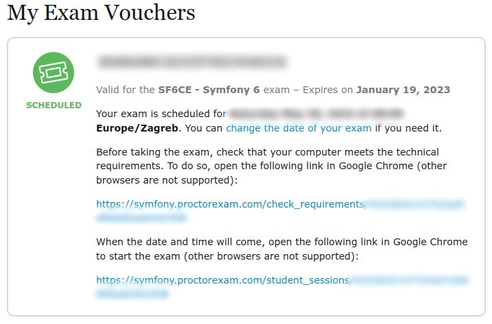
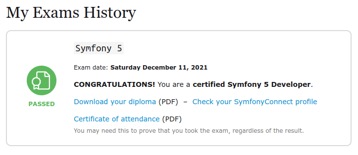

# Road to Symfony certification

**Welcome to the repository dedicated to help you with the Symfony certification exam, based on Symfony 6.**

## Table of Contents

* [Introduction](#introduction)
    * [Why this repo?](#why-this-repo)
    * [Features](#features)
* [Exam Topics](#exam-topics)
    * [PHP](#php)
    * [HTTP](#http)
    * [Symfony Architecture](#symfony-architecture)
    * [Controllers](#controllers)
    * [Routing](#routing)
    * [Templating with Twig](#templating-with-twig)
    * [Forms](#forms)
    * [Data Validation](#data-validation)
    * [Dependency Injection](#dependency-injection)
    * [Security](#security)
    * [HTTP Caching](#http-caching)
    * [Console](#console)
    * [Automated Tests](#automated-tests)
    * [Miscellaneous](#miscellaneous)
* [About the Exam](#about-the-exam)
* [Changelog](#changelog)
* [Contributing](#contributing)
* [Thanks](#thanks)
* [About the author](#about-the-author)
* [License](#license)

## Introduction

More info coming soon.

### Why this repo?

### Features

## Exam Topics

This is an official topics list that has been published by Symfony. You can find them also on their [website](https://certification.symfony.com/).

### PHP

* PHP API up to PHP 8.1 version
* Object Oriented Programming
* Namespaces
* Interfaces
* Anonymous functions and closures
* Abstract classes
* Exception and error handling
* Traits
* PHP extensions
* SPL

### HTTP

* Client / Server interaction - [https://www.rfc-editor.org/rfc/rfc9110.html](https://www.rfc-editor.org/rfc/rfc9110.html)
* Status codes - [https://developer.mozilla.org/en-US/docs/Web/HTTP/Status](https://developer.mozilla.org/en-US/docs/Web/HTTP/Status)
* HTTP request -[https://developer.mozilla.org/en-US/docs/Web/HTTP/Messages#http_requests](https://developer.mozilla.org/en-US/docs/Web/HTTP/Messages#http_requests)
* HTTP response - [https://developer.mozilla.org/en-US/docs/Web/HTTP/Messages#http_responses](https://developer.mozilla.org/en-US/docs/Web/HTTP/Messages#http_responses)
* HTTP methods - [https://developer.mozilla.org/en-US/docs/Web/HTTP/Methods](https://developer.mozilla.org/en-US/docs/Web/HTTP/Methods)
* Cookies 
    * About cookies - [https://developer.mozilla.org/en-US/docs/Web/HTTP/Cookies](https://developer.mozilla.org/en-US/docs/Web/HTTP/Cookies)
    * Setting Cookies - [https://symfony.com/doc/6.0/components/http_foundation.html#setting-cookies](https://symfony.com/doc/6.0/components/http_foundation.html#setting-cookies)
* Caching - [https://developer.mozilla.org/en-US/docs/Web/HTTP/Caching](https://developer.mozilla.org/en-US/docs/Web/HTTP/Caching)
* Content negotiation 
    * About content negotiation - [https://developer.mozilla.org/en-US/docs/Web/HTTP/Content_negotiation](https://developer.mozilla.org/en-US/docs/Web/HTTP/Content_negotiation)
    * Quality values - [https://developer.mozilla.org/en-US/docs/Glossary/Quality_values](https://developer.mozilla.org/en-US/docs/Glossary/Quality_values)
* Language detection 
    * About language detection - [https://developer.mozilla.org/en-US/docs/Web/HTTP/Headers/Accept-Language](https://developer.mozilla.org/en-US/docs/Web/HTTP/Headers/Accept-Language)
    * Locale listener - [https://github.com/symfony/symfony/blob/6.0/src/Symfony/Component/HttpKernel/EventListener/LocaleListener.php](https://github.com/symfony/symfony/blob/6.0/src/Symfony/Component/HttpKernel/EventListener/LocaleListener.php)
    * How to Work with the User's Locale - [https://symfony.com/doc/6.0/translation/locale.html](https://symfony.com/doc/6.0/translation/locale.html)
    * New in Symfony 5.4: Language Negotiation - [https://symfony.com/blog/new-in-symfony-5-4-language-negotiation](https://symfony.com/blog/new-in-symfony-5-4-language-negotiation)
* Symfony HttpClient component - [https://symfony.com/doc/6.0/http_client.html](https://symfony.com/doc/6.0/http_client.html)

### Symfony Architecture

* Symfony Flex - [https://symfony.com/doc/6.0/setup/flex.html](https://symfony.com/doc/6.0/setup/flex.html)
* License - [https://symfony.com/doc/6.0/contributing/code/license.html](https://symfony.com/doc/6.0/contributing/code/license.html)
* Components - [https://symfony.com/components](https://symfony.com/components)
* Bridges - [https://stackoverflow.com/questions/11888522/what-are-symfony-bridges-bundles-and-vendor](https://stackoverflow.com/questions/11888522/what-are-symfony-bridges-bundles-and-vendor)
* Code organization - [https://symfony.com/doc/6.0/best_practices.html#business-logic](https://symfony.com/doc/6.0/best_practices.html#business-logic)
* Request handling - [https://symfony.com/doc/6.0/introduction/http_fundamentals.html](https://symfony.com/doc/6.0/introduction/http_fundamentals.html)
* Exception handling - [https://symfony.com/doc/6.0/controller/error_pages.html](https://symfony.com/doc/6.0/controller/error_pages.html)
* Event dispatcher and kernel events
    * Built-in Symfony Events - [https://symfony.com/doc/6.0/reference/events.html](https://symfony.com/doc/6.0/reference/events.html)
    * The HttpKernel Component - [https://symfony.com/doc/6.0/components/http_kernel.html](https://symfony.com/doc/6.0/components/http_kernel.html)
    * The EventDispatcher Component - [https://symfony.com/doc/6.0/components/event_dispatcher.html](https://symfony.com/doc/6.0/components/event_dispatcher.html)
* Official best practices - [https://symfony.com/doc/6.0/best_practices.html](https://symfony.com/doc/6.0/best_practices.html
* Release management - [https://symfony.com/doc/6.0/contributing/community/releases.html](https://symfony.com/doc/6.0/contributing/community/releases.html)
* Backward compatibility promise - [https://symfony.com/doc/6.0/contributing/code/bc.html](https://symfony.com/doc/6.0/contributing/code/bc.html)
* Deprecations best practices - [https://symfony.com/doc/6.0/contributing/code/conventions.html#deprecating-code](https://symfony.com/doc/6.0/contributing/code/conventions.html#deprecating-code)
* Release management and roadmap schedule - [https://symfony.com/releases](https://symfony.com/releases)
* Framework interoperability and PSRs
    * Interoperability - [https://symfony.com/six-good-reasons#6-interoperability](https://symfony.com/six-good-reasons#6-interoperability)
    * Coding standards - [https://symfony.com/doc/6.0/contributing/code/standards.html](https://symfony.com/doc/6.0/contributing/code/standards.html)
    * PSR-1 - [https://www.php-fig.org/psr/psr-1/](https://www.php-fig.org/psr/psr-1/)
    * PSR-2 - [https://www.php-fig.org/psr/psr-2/](https://www.php-fig.org/psr/psr-2/)
    * PSR-4 - [https://www.php-fig.org/psr/psr-4/](https://www.php-fig.org/psr/psr-4/)
    * PSR-18 - [https://www.php-fig.org/psr/psr-18/](https://www.php-fig.org/psr/psr-18/)
* Naming conventions - [https://symfony.com/doc/6.0/contributing/code/conventions.html](https://symfony.com/doc/6.0/contributing/code/conventions.html)

### Controllers

* Naming conventions - [https://symfony.com/doc/6.0/controller.html#a-basic-controller](https://symfony.com/doc/6.0/controller.html#a-basic-controller)
* The base AbstractController class - [https://github.com/symfony/symfony/blob/6.0/src/Symfony/Bundle/FrameworkBundle/Controller/AbstractController.php](https://github.com/symfony/symfony/blob/6.0/src/Symfony/Bundle/FrameworkBundle/Controller/AbstractController.php)
* The request - [https://symfony.com/doc/6.0/components/http_foundation.html#request](https://symfony.com/doc/6.0/components/http_foundation.html#request)
* The response - [https://symfony.com/doc/6.0/components/http_foundation.html#response](https://symfony.com/doc/6.0/components/http_foundation.html#response)
* The cookies - [https://symfony.com/doc/6.0/components/http_foundation.html#setting-cookies](https://symfony.com/doc/6.0/components/http_foundation.html#setting-cookies)
* The session - [https://symfony.com/doc/6.0/components/http_foundation/sessions.html](https://symfony.com/doc/6.0/components/http_foundation/sessions.html)
* The flash messages - [https://symfony.com/doc/6.0/controller.html#flash-messages](https://symfony.com/doc/6.0/controller.html#flash-messages)
* HTTP redirects - [https://symfony.com/doc/6.0/controller.html#redirecting](https://symfony.com/doc/6.0/controller.html#redirecting)
* Internal redirects - [https://symfony.com/doc/6.0/controller/forwarding.html](https://symfony.com/doc/6.0/controller/forwarding.html)
* Generate 404 pages - [https://symfony.com/doc/6.0/controller.html#managing-errors-and-404-pages](https://symfony.com/doc/6.0/controller.html#managing-errors-and-404-pages)
* File upload - [https://symfony.com/doc/6.0/controller/upload_file.html](https://symfony.com/doc/6.0/controller/upload_file.html)
* Built-in internal controllers
    * RedirectController - [https://symfony.com/doc/6.0/routing.html#redirecting-to-urls-and-routes-directly-from-a-route](https://symfony.com/doc/6.0/routing.html#redirecting-to-urls-and-routes-directly-from-a-route)
    * TemplateController - [https://symfony.com/doc/6.0/templates.html#rendering-a-template-directly-from-a-route](https://symfony.com/doc/6.0/templates.html#rendering-a-template-directly-from-a-route)

### Routing

* Configuration (YAML, XML, PHP & attributes/annotations) - [https://github.com/symfony/symfony/blob/6.0/src/Symfony/Component/Routing/Annotation/Route.php](https://github.com/symfony/symfony/blob/6.0/src/Symfony/Component/Routing/Annotation/Route.php)
* Restrict URL parameters - [https://symfony.com/doc/6.0/routing.html#route-parameters](https://symfony.com/doc/6.0/routing.html#route-parameters)
* Set default values to URL parameters - [https://symfony.com/doc/6.0/routing.html#optional-parameters](https://symfony.com/doc/6.0/routing.html#optional-parameters)
* Generate URL parameters - [https://symfony.com/doc/6.0/routing.html#generating-urls](https://symfony.com/doc/6.0/routing.html#generating-urls)
* Trigger redirects - [https://symfony.com/doc/6.0/routing.html#redirecting-to-urls-and-routes-directly-from-a-route](https://symfony.com/doc/6.0/routing.html#redirecting-to-urls-and-routes-directly-from-a-route)
* Special internal routing attributes - [https://symfony.com/doc/6.0/routing.html#special-parameters](https://symfony.com/doc/6.0/routing.html#special-parameters)
* Domain name matching - [https://symfony.com/doc/6.0/routing.html#sub-domain-routing](https://symfony.com/doc/6.0/routing.html#sub-domain-routing)
* Conditional request matching - [https://symfony.com/doc/6.0/routing.html#matching-expressions](https://symfony.com/doc/6.0/routing.html#matching-expressions)
* HTTP methods matching - [https://symfony.com/doc/6.0/routing.html#matching-http-methods](https://symfony.com/doc/6.0/routing.html#matching-http-methods)
* User's locale guessing - [https://symfony.com/doc/6.0/routing.html#localized-routes-i18n](https://symfony.com/doc/6.0/routing.html#localized-routes-i18n)
* Router debugging - [https://symfony.com/doc/6.0/routing.html#debugging-routes](https://symfony.com/doc/6.0/routing.html#debugging-routes)

### Templating with Twig

* Twig syntax up to 3.3 version
* Auto escaping
* Template inheritance
* Global variables
* Filters and functions
* Template includes
* Loops and conditions
* URLs generation
* Controller rendering
* Translations and pluralization
* String interpolation
* Assets management
* Debugging variables

### Forms

* Forms creation
* Forms handling
* Form types
* Forms rendering with Twig
* Forms theming
* CSRF protection
* Handling file upload
* Built-in form types
* Data transformers
* Form events
* Form type extensions

### Data Validation

* PHP object validation - [https://symfony.com/doc/6.0/validation.html](https://symfony.com/doc/6.0/validation.html)
* Built-in validation constraints - [https://symfony.com/doc/6.0/validation.html#supported-constraints](https://symfony.com/doc/6.0/validation.html#supported-constraints)
* Validation scopes - [https://symfony.com/doc/6.0/validation.html#constraint-targets](https://symfony.com/doc/6.0/validation.html#constraint-targets)
* Validation groups - [https://symfony.com/doc/6.0/validation/groups.html](https://symfony.com/doc/6.0/validation/groups.html)
* Group sequence - [https://symfony.com/doc/6.0/validation/sequence_provider.html](https://symfony.com/doc/6.0/validation/sequence_provider.html)
* Custom callback validators - [https://symfony.com/doc/6.0/reference/constraints/Callback.html](https://symfony.com/doc/6.0/reference/constraints/Callback.html)
* Violations builder - [https://symfony.com/doc/6.0/validation/custom_constraint.html](https://symfony.com/doc/6.0/validation/custom_constraint.html)

### Dependency Injection

* Service container - [https://symfony.com/doc/6.0/service_container.html](https://symfony.com/doc/6.0/service_container.html)
* Built-in services
* Configuration parameters
* Services registration
* Tags - [https://symfony.com/doc/6.0/service_container/tags.html](https://symfony.com/doc/6.0/service_container/tags.html)
* Semantic configuration
* Factories - [https://symfony.com/doc/6.0/service_container/factories.html](https://symfony.com/doc/6.0/service_container/factories.html)
* Compiler passes - [https://symfony.com/doc/6.0/service_container/compiler_passes.html](https://symfony.com/doc/6.0/service_container/compiler_passes.html)
* Services autowiring - [https://symfony.com/doc/6.0/service_container/autowiring.html](https://symfony.com/doc/6.0/service_container/autowiring.html)

### Security

* Authentication - [https://symfony.com/doc/6.0/security.html#authenticating-users](https://symfony.com/doc/6.0/security.html#authenticating-users)
* Authorization - [https://symfony.com/doc/6.0/security.html#access-control-authorization](https://symfony.com/doc/6.0/security.html#access-control-authorization)
* Configuration - [https://symfony.com/doc/6.0/reference/configuration/security.html](https://symfony.com/doc/6.0/reference/configuration/security.html)
* Providers - [https://symfony.com/doc/6.0/security.html#loading-the-user-the-user-provider](https://symfony.com/doc/6.0/security.html#loading-the-user-the-user-provider)
* Firewalls - [https://symfony.com/doc/6.0/security.html#the-firewall](https://symfony.com/doc/6.0/security.html#the-firewall)
* Users - [https://symfony.com/doc/6.0/security.html#the-user](https://symfony.com/doc/6.0/security.html#the-user)
* Password hashers - [https://symfony.com/doc/6.0/security.html#registering-the-user-hashing-passwords](https://symfony.com/doc/6.0/security.html#registering-the-user-hashing-passwords)
* Roles - [https://symfony.com/doc/6.0/security.html#roles](https://symfony.com/doc/6.0/security.html#roles)
* Access Control Rules - [https://symfony.com/doc/6.0/security/access_control.html](https://symfony.com/doc/6.0/security/access_control.html)
* Authenticators - [https://symfony.com/doc/6.0/security/custom_authenticator.html](https://symfony.com/doc/6.0/security/custom_authenticator.html)
* Voters and voting strategies - [https://symfony.com/doc/6.0/security/voters.html](https://symfony.com/doc/6.0/security/voters.html)

### HTTP Caching

#### General read about HTTP caching
* [https://www.mnot.net/cache_docs/](https://www.mnot.net/cache_docs/)
* [https://csswizardry.com/2019/03/cache-control-for-civilians/](https://csswizardry.com/2019/03/cache-control-for-civilians/)
* [https://developer.mozilla.org/en-US/docs/Web/HTTP/Caching](https://developer.mozilla.org/en-US/docs/Web/HTTP/Caching)
* [https://tomayko.com/blog/2008/things-caches-do](https://tomayko.com/blog/2008/things-caches-do)
* [https://web.dev/http-cache/](https://web.dev/http-cache/)

#### Symfony related links

* Cache types (browser, proxies and reverse-proxies) - [https://symfony.com/doc/6.0/http_cache.html](https://symfony.com/doc/6.0/http_cache.html)
* Expiration (Expires, Cache-Control) - [https://symfony.com/doc/6.0/http_cache/expiration.html](https://symfony.com/doc/6.0/http_cache/expiration.html)
* Validation (ETag, Last-Modified) - [https://symfony.com/doc/6.0/http_cache/validation.html](https://symfony.com/doc/6.0/http_cache/validation.html)
* Client side caching - [https://developer.mozilla.org/en-US/docs/Web/HTTP/Caching#private_browser_caches](https://developer.mozilla.org/en-US/docs/Web/HTTP/Caching#private_browser_caches)
* Server side caching - [https://symfony.com/doc/6.0/http_cache.html#caching-with-a-gateway-cache](https://symfony.com/doc/6.0/http_cache.html#caching-with-a-gateway-cache)
* Edge Side Includes - [https://symfony.com/doc/6.0/http_cache/esi.html](https://symfony.com/doc/6.0/http_cache/esi.html)

### Console

* Built-in commands - [https://symfony.com/doc/6.0/components/console/usage.html#built-in-commands](https://symfony.com/doc/6.0/components/console/usage.html#built-in-commands)
* Custom commands - [https://symfony.com/doc/6.0/console.html#creating-a-command](https://symfony.com/doc/6.0/console.html#creating-a-command)
* Configuration - [https://symfony.com/doc/6.0/console.html#configuring-the-command](https://symfony.com/doc/6.0/console.html#configuring-the-command)
* Options and arguments - [https://symfony.com/doc/6.0/console/input.html](https://symfony.com/doc/6.0/console/input.html)
* Input and Output objects
  * Input - [https://symfony.com/doc/6.0/console.html#console-input](https://symfony.com/doc/6.0/console.html#console-input)
  * Output - [https://symfony.com/doc/6.0/console.html#console-output](https://symfony.com/doc/6.0/console.html#console-output)
* Built-in helpers
  * Question Helper - [https://symfony.com/doc/6.0/components/console/helpers/questionhelper.html](https://symfony.com/doc/6.0/components/console/helpers/questionhelper.html)
  * Formatter Helper - [https://symfony.com/doc/6.0/components/console/helpers/formatterhelper.html](https://symfony.com/doc/6.0/components/console/helpers/formatterhelper.html)
  * Progress Bar - [https://symfony.com/doc/6.0/components/console/helpers/progressbar.html](https://symfony.com/doc/6.0/components/console/helpers/progressbar.html)
  * Table - [https://symfony.com/doc/6.0/components/console/helpers/table.html](https://symfony.com/doc/6.0/components/console/helpers/table.html)
  * Debug Formatter Helper - [https://symfony.com/doc/6.0/components/console/helpers/debug_formatter.html](https://symfony.com/doc/6.0/components/console/helpers/debug_formatter.html)
  * Cursor Helper - [https://symfony.com/doc/6.0/components/console/helpers/cursor.html](https://symfony.com/doc/6.0/components/console/helpers/cursor.html)
* Console events - [https://symfony.com/doc/6.0/components/console/events.html](https://symfony.com/doc/6.0/components/console/events.html)
* Verbosity levels - [https://symfony.com/doc/6.0/console/verbosity.html](https://symfony.com/doc/6.0/console/verbosity.html)

### Automated Tests

* Unit tests with PHPUnit - [https://symfony.com/doc/6.0/testing.html#unit-tests](https://symfony.com/doc/6.0/testing.html#unit-tests)
* Functional tests with PHPUnit - [https://symfony.com/doc/6.0/testing.html#integration-tests](https://symfony.com/doc/6.0/testing.html#integration-tests)
* Client object - [https://symfony.com/doc/6.0/testing.html#write-your-first-application-test](https://symfony.com/doc/6.0/testing.html#write-your-first-application-test)
* Crawler object - [https://symfony.com/doc/6.0/testing/dom_crawler.html](https://symfony.com/doc/6.0/testing/dom_crawler.html)
* Profiler object - [https://symfony.com/doc/6.0/testing/profiling.html](https://symfony.com/doc/6.0/testing/profiling.html)
* Framework objects access - [https://symfony.com/doc/6.0/testing.html#retrieving-services-in-the-test](https://symfony.com/doc/6.0/testing.html#retrieving-services-in-the-test)
* Client configuration - [https://symfony.com/doc/6.0/components/browser_kit.html#creating-a-client](https://symfony.com/doc/6.0/components/browser_kit.html#creating-a-client)
* Request and response objects introspection - [https://symfony.com/doc/6.0/testing.html#making-requests](https://symfony.com/doc/6.0/testing.html#making-requests)
* PHPUnit bridge - [https://symfony.com/doc/6.0/components/phpunit_bridge.html](https://symfony.com/doc/6.0/components/phpunit_bridge.html)
* Handling legacy deprecated code - [https://symfony.com/doc/6.0/components/phpunit_bridge.html#write-assertions-about-deprecations](https://symfony.com/doc/6.0/components/phpunit_bridge.html#write-assertions-about-deprecations)

### Miscellaneous

* Configuration (including DotEnv and ExpressionLanguage components)
  * Configuration - [https://symfony.com/doc/6.0/configuration.html](https://symfony.com/doc/6.0/configuration.html)
  * DotEnv - [https://symfony.com/doc/6.0/configuration.html#configuration-based-on-environment-variables](https://symfony.com/doc/6.0/configuration.html#configuration-based-on-environment-variables)
  * ExpressionLanguage - [https://symfony.com/doc/6.0/components/expression_language.html](https://symfony.com/doc/6.0/components/expression_language.html)
* Error handling - [https://symfony.com/doc/6.0/controller/error_pages.html](https://symfony.com/doc/6.0/controller/error_pages.html)
* Code debugging
* Deployment best practices - [https://symfony.com/doc/6.0/deployment.html](https://symfony.com/doc/6.0/deployment.html)
* Cache, Process and Serializer components
  * Cache - [https://symfony.com/doc/6.0/cache.html](https://symfony.com/doc/6.0/cache.html)
  * Process - [https://symfony.com/doc/6.0/components/process.html](https://symfony.com/doc/6.0/components/process.html)
  * Serializer - [https://symfony.com/doc/6.0/serializer.html](https://symfony.com/doc/6.0/serializer.html)
* Messenger component - [https://symfony.com/doc/6.0/components/messenger.html](https://symfony.com/doc/6.0/components/messenger.html)
* Mime and Mailer components
  * Mime - [https://symfony.com/doc/6.0/components/mime.html](https://symfony.com/doc/6.0/components/mime.html) 
  * Mailer - [https://symfony.com/doc/6.0/mailer.html](https://symfony.com/doc/6.0/mailer.html) 
* Filesystem and Finder components
  * Filesystem - [https://symfony.com/doc/6.0/components/filesystem.html](https://symfony.com/doc/6.0/components/filesystem.html)
  * Finder - [https://symfony.com/doc/6.0/components/finder.html](https://symfony.com/doc/6.0/components/finder.html)
* Lock component - [https://symfony.com/doc/6.0/components/lock.html](https://symfony.com/doc/6.0/components/lock.html)
* Web Profiler, Web Debug Toolbar and Data collectors - [https://symfony.com/doc/6.0/profiler.html](https://symfony.com/doc/6.0/profiler.html)
* Internationalization and localization (and Intl component) - [https://symfony.com/doc/6.0/translation.html](https://symfony.com/doc/6.0/translation.html)
* Runtime component - [https://symfony.com/doc/6.0/components/runtime.html](https://symfony.com/doc/6.0/components/runtime.html)

## About the exam

To take the exam, you should buy the exam voucher. The usual price is 250 euros. However, Symfony offers some discounts about two times a year. Usually, it is on Black Friday, and sometimes mid-June or whenever the Symfony exam version is announced. Deals go up to 40%, so I recommend that you aim to buy a voucher at that time. 

### Buying a voucher

After successful checkout, you should see an email with "Order Confirmation and Vouchers for the Symfony Certification Exam" subject in your inbox. The contents of the email body should be something like this:

If you are already a member of SymfonyConnect, just navigate [https://certification.symfony.com/manager/voucher](https://certification.symfony.com/manager/voucher)(step 3), select the relevant Symfony version from the dropdown and paste the voucher code inside the input. That's it, you are ready to schedule the exam date. 

### Scheduling exam date

Once you are prepared and feel comfortable taking the exam, go to the "My Vouchers" section and select the date and time of your exam. I suggest that you schedule the exam in the morning rather than afternoon or evening because you will be fresh and full of energy after the night's sleep. This is how the scheduled exam for looks like:

Shortly after your date and time confirmation, Symfony should email you the confirmation notice and a check requirements link. I recommend testing your exam environment on that link to eliminate any late surprises before the exam. Also, be advised that only the Google Chrome browser is supported.

In the "My Vouchers" section, there should be a piece of information about the scheduled exam, with the additional link, which you will access at the exam time.

### General overview

More info coming soon.

### Successful exam delivery

After the successful exam delivery, you should receive an official email from Symfony about your exam result in a few business days. Here is an example of that email:

Also, in the "My Exams History" you should be able to see the results:

That's about it. Congratulations on getting certified :).

## Changelog

Please see [CHANGELOG](CHANGELOG.md) for more information on recent changes.

## Contributing

Please see [CONTRIBUTING](CONTRIBUTING.md) for details.

## Thanks

Special thanks to [Thomas Berends](https://github.com/ThomasBerends) for compiling the list of Symfony certification exam preparation resources, which author of this repository used in order to prepare for Symfony certification exams. This repository covers missing parts, as the original repo did not provide any code examples to tinker with.

Also, thanks to [webmozart](https://github.com/webmozart) for open-sourcing the Symfony Forms workshop repository, which was used as the initial code base for this repository.

## About the author

[Mario](https://connect.symfony.com/profile/marioblazek) is working as a software developer more than ten years now. He is Symfony and Twig certified developer.

## License

The MIT License (MIT). Please see the [License File](LICENSE) for more information.
